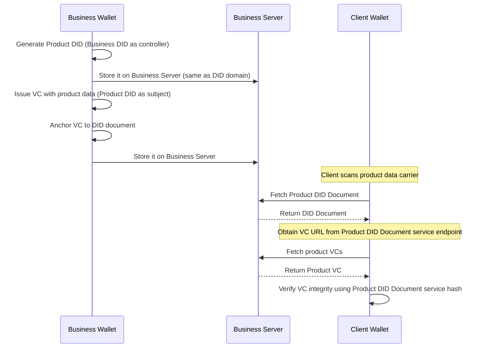

# Digital Product Passport (DPP) Demo with DIDs & Verifiable Credentials

## Overview

This project was developed as an **experimental implementation** to deepen understanding of how **Digital Product Passports (DPPs)** can be modeled using **Decentralized Identifiers (DIDs)** and **Verifiable Credentials (VCs)**.

**Note:** This project is for demonstration and learning purposes only. It is not suitable for production or security-critical applications.

## Key Learning Goals

1. **Exploring DID Design and Control Models**
   - Understand the implications of different DID methods (`did:web`, `did:key`) in practical DPP scenarios.
   - Evaluate how DID Documents serve as a persistent, verifiable reference for product identity and metadata.

2. **Experimenting with Verifiable Credentials (VCs)**
   - Implement credential issuance and discovery flows.
   - Explore how product information (materials, provenance, compliance) can be expressed as structured and verifiable data.
   - Test how credentials can be “anchored” to DIDs to support traceability and authenticity.

3. **Understanding the User Journey in DPP Systems**
   - Simulate interactions between actors (Business, Client) to identify usability and data flow challenges.
   - Reflect on how user agents (wallets) can provide intuitive interfaces for credential exchange and verification.

### Research and Inspiration

This learning exploration builds upon insights and design principles from the following key resources:

- [Digital Product Passport Management with Decentralised Identifiers and Verifiable Credentials](https://arxiv.org/abs/2410.15758)
- [United Nations Transparency Protocol: DPP](https://spec-untp-fbb45f.opensource.unicc.org/docs/specification/DigitalProductPassport)
- [Implementing Digital Product Passports using decentralized identity standards](https://medium.com/spherity/implementing-digital-product-passports-using-decentralized-identity-standards-f1102c452020)

## Getting Started

**1. Installation**

```bash
git clone https://github.com/Jorge-Lopes/dpp-did.git
cd dpp-did
make install
```

**2. Run Wallet Unit Tests**

```bash
cd wallet
npm test
```

## Run the Demo

Open **three terminal windows** for the following processes:

**Terminal 1 – Docker manager**

Start all containners:

```bash
make system-up
```

**Terminal 2 – Business Wallet**

Set up the Wallet and generate Business DID:

```bash
make business-wallet-init
```

Create new Product and generate Product DID:

```bash
make business-wallet-product
```

Generate Product Verifiable Credential:
> DID will be set as `did:web:business_server%3A7003:products:0`

```bash
make business-wallet-credential PRODUCT_DID=<DID>
```

**Terminal 3 – Client Wallet**

Set up the Wallet and generate Client DID:

```bash
make client-wallet-init
```

Get Product DID Document from Product DID:
> DID will be set as `did:web:business_server%3A7003:products:0`

```bash
make client-wallet-get-did DID=<DID>
```

Get Product Verifiable Credential from service endpoint
> PATH will be set as `/products/0/credentials/materials.json`

```bash
make client-wallet-get-credential PATH=<PATH>
```


## Workflow: The “Happy Path”

### Actors

- **Business** – creates and issues product DIDs and VCs.
- **Client** – verifies product information and assumes ownership.

### Components

- Business Wallet
- Business DID (did:web)
- Business Local Server (web domain)
- Client Wallet
- Client DID (did:key)
- Product DID (did:web)
- Product Verifiable Credential(s)

### Sequence Diagram



## Improvements to be made

- Improve file system management between the business wallet and the business server
- Implement wallet to wallet messaging protocol similar to DIDComm
- Improve testing coverage
