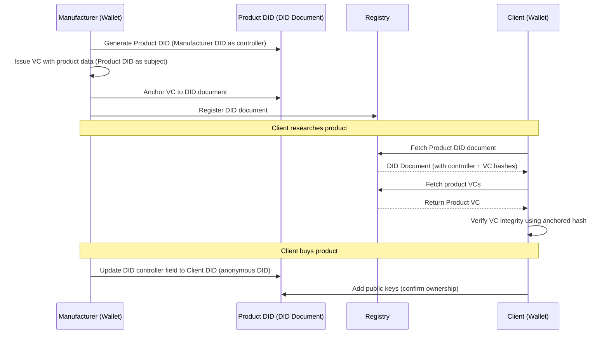

# Digital Product Passport (DPP) Demo with DIDs & Verifiable Credentials

## Overview

This project was developed as an **experimental implementation** to deepen understanding of how **Digital Product Passports (DPPs)** can be modeled using **Decentralized Identifiers (DIDs)** and **Verifiable Credentials (VCs)**.
Rather than focusing solely on technical execution, the goal is to explore **design patterns, trust models, and interoperability concepts** inspired by recent research and emerging standards.

**Note:** This project is for demonstration and learning purposes only. It is not suitable for production or security-critical applications.

## Getting Started

### 1. Installation

```bash
git clone https://github.com/Jorge-Lopes/dpp-did.git
cd dpp-did
npm install
```

### 2. Run Unit Tests

```bash
npm test
```

## Running the Demo

Open **three terminal windows** for the following processes:

### **Terminal 1 – Manufacturer Server**

Start the local web server:

```bash
node scripts/manufacturer.js start-server
```

### **Terminal 2 – Manufacturer Wallet**

Set up the Manufacturer wallet and generate the entity and product DIDs:

```bash
node scripts/manufacturer.js setup
```

### **Terminal 3 – Client Wallet**

1. List available DIDs:

   ```bash
   node scripts/client.js get-did-list
   ```

2. Retrieve a specific Product DID:

   ```bash
   node scripts/client.js get-did --did did:web:localhost:products:0
   ```

3. Fetch the Product Materials Verifiable Credential:

   ```bash
   node scripts/client.js get-vc --vc https://localhost/products/0/credentials/materials.json
   ```

---

## Workflow: The “Happy Path”

### **Actors**

- **Manufacturer** – creates and issues product DIDs and VCs.
- **Client** – verifies product information and assumes ownership.

### **Components**

- Manufacturer Wallet
- Manufacturer DID (did:web)
- Manufacturer Local Server (web domain)
- Client Wallet
- Client DID (did:key)
- Product DID (did:web)
- Product Verifiable Credential(s)

### **Sequence Diagram**



## Key Learning Goals

1. **Bridging Theory and Implementation**
   Translate the conceptual frameworks described in the referenced articles into a tangible, working demonstration.
   The project examines how the **Digital Product Passport lifecycle**—creation, registration, verification, and transfer—can be represented through DIDs and VCs.

2. **Exploring DID Design and Control Models**
   - Understand the implications of different DID methods (`did:web`, `did:key`) in practical DPP scenarios.
   - Investigate how **controller relationships** and **ownership updates** can be modeled during a product’s lifecycle (e.g., manufacturer → client).
   - Evaluate how DID Documents serve as a persistent, verifiable reference for product identity and metadata.

3. **Experimenting with Verifiable Credentials (VCs)**
   - Implement **credential issuance, discovery, and validation flows** based on W3C standards.
   - Explore how product information (materials, provenance, compliance) can be expressed as structured and verifiable data.
   - Test how credentials can be “anchored” to DIDs to support traceability and authenticity.

4. **Understanding the User Journey in DPP Systems**
   - Simulate interactions between actors (Manufacturer, Client) to identify usability and data flow challenges.
   - Reflect on how user agents (wallets) can provide intuitive interfaces for credential exchange and verification.

---

### Research and Inspiration

This learning exploration builds upon insights and design principles from the following key resources:

- [Digital Product Passport Management with Decentralised Identifiers and Verifiable Credentials](https://arxiv.org/abs/2410.15758)
- [United Nations Transparency Protocol: DPP](https://spec-untp-fbb45f.opensource.unicc.org/docs/specification/DigitalProductPassport)
- [Implementing Digital Product Passports using decentralized identity standards](https://medium.com/spherity/implementing-digital-product-passports-using-decentralized-identity-standards-f1102c452020)
