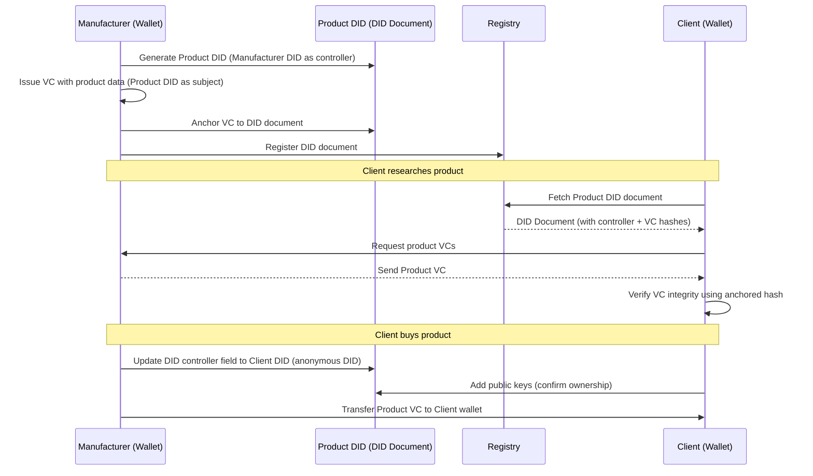

## Happy Path

### Actors

- Manufacturer
- Client

### Components

- Manufacturer Wallet
- Manufacturer DID (did:web)
- Manufacturer web domain (local server)
- Client Wallet
- Client DID (did:key)
- Product DID (did:web)
- Product Verifiable Credential(s)
- Verifiable Data Registry

### Sequence Diagram

