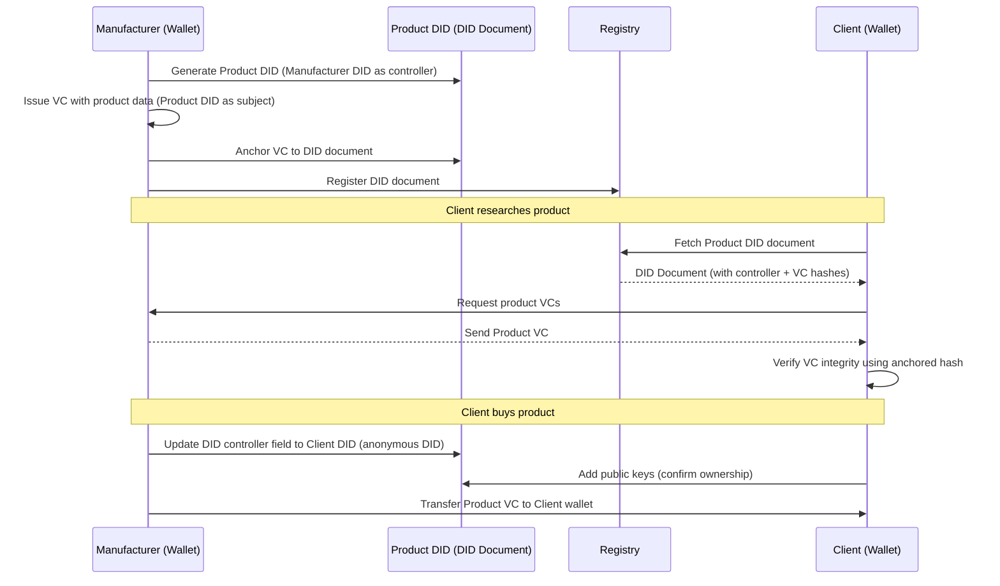

# Digital Product Passport (DPP) Demo with DIDs & Verifiable Credentials

## Overview

This project demonstrates a **Digital Product Passport (DPP)** workflow built with **Decentralized Identifiers (DIDs)** and **Verifiable Credentials (VCs)**.
It simulates the interaction between a **Manufacturer** and a **Client**, showing how:

- Each entity (and the product itself) is assigned a DID.
- Product data and ownership can be securely managed, verified, and transferred.
- Trust is established without relying on centralized systems.

**Note:** This project is for demonstration and learning purposes only. It is not suitable for production or security-critical applications.

---

## Getting Started

### 1. Installation

```bash
git clone https://github.com/Jorge-Lopes/dpp-did.git
cd dpp-did
npm install
```

### 2. Run Unit Tests

```bash
npm test
```

---

## Running the Demo

Open **three terminal windows** for the following processes:

### **Terminal 1 – Manufacturer Server**

Start the local web server:

```bash
node scripts/manufacturer.js start-server
```

### **Terminal 2 – Manufacturer Wallet**

Set up the Manufacturer wallet and generate the entity and product DIDs:

```bash
node scripts/manufacturer.js setup
```

### **Terminal 3 – Client Wallet**

1. List available DIDs:

   ```bash
   node scripts/client.js get-did-list
   ```

2. Retrieve a specific Product DID:

   ```bash
   node scripts/client.js get-did --did did:web:localhost:products:0
   ```

3. Fetch the Product Materials Verifiable Credential:

   ```bash
   node scripts/client.js get-vc --vc https://localhost/products/0/credentials/materials.json
   ```

---

## Workflow: The “Happy Path”

### **Actors**

- **Manufacturer** – creates and issues product credentials.
- **Client** – verifies product information and assumes ownership.

### **Components**

- Manufacturer Wallet
- Manufacturer DID (did:web)
- Manufacturer Local Server (web domain)
- Client Wallet
- Client DID (did:key)
- Product DID (did:web)
- Product Verifiable Credential(s)

### **Sequence Diagram**


